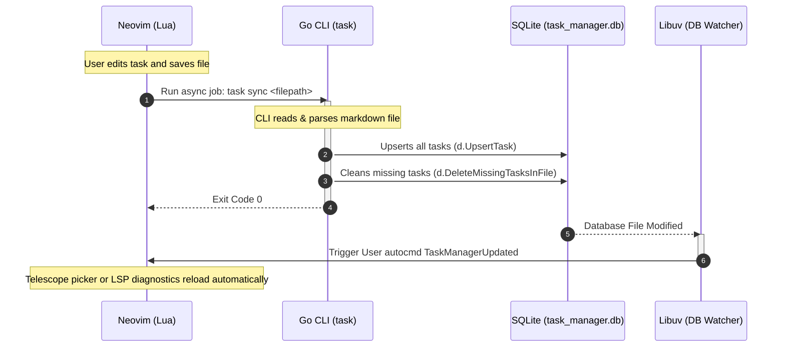

#                                                                                                                                                                                                 Developer Onboarding Guide (AGENTS.md) Welcome to the `tasks.nvim` repository! This guide is designed to help any subsequent AI coding agent or new developer quickly understand the architecture, directory layout, database schemas, and design invariants of this project.
---

## 1. Problem Statement

### Who is the end user?
The end user is any future AI coding agent or new human developer onboarding to the `tasks.nvim` repository.

### Why is the current state inadequate?
Currently, the codebase is a hybrid, multi-language system (Lua client in Neovim, Go CLI/TUI companion, and an SQLite backend operating in WAL mode). Without clear documentation:
- Cold-start agents must spend significant context and time scanning the codebase.
- Agents risk introducing database locks, breaking the markdown-to-SQLite synchronization loops, or misunderstanding the commenting-out delete mechanism.
- Silent failures (like note navigation errors) or synchronization latency (due to SQLite's WAL mode) remain undocumented, leading to poor design decisions.

### What value does this guide unlock?
This onboarding guide unlocks immediate, reliable, and architecturally-sound contributions to the repository. It details core interfaces, sequence flows, known pitfalls, and clear blueprints for future features, ensuring new developers can safely build, test, and extend the application without breaking existing integration invariants.

---

## 2. Technical & Component Overview

### Major Components and Data Flow
1. **Lua Client (`lua/task_manager/`, `plugin/`)**: Handlers for buffer saves, Telescope menus, syntax matching, and custom headless LSP diagnostics.
2. **Go CLI/TUI Companion (`tui/`)**: Multi-command Cobra CLI, SQLite connector, relative date parsing, and a Bubble Tea interactive UI.
3. **SQLite Database WAL Mode (`task_manager.db`)**: Relational store for tasks, tags, and key-value metadata, operating in WAL mode.

### Real-Time Buffer Save Synchronization Flow
The following sequence diagram represents the real-time coordination between Neovim, the Go binary, and the SQLite database:



### Key Abstractions
- **Go Struct: `parser.Task`** ([tui/parser/parser.go](file:///usr/local/google/home/tanmayvijay/tasks.nvim/tui/parser/parser.go))
  Holds raw task metadata parsed directly from markdown task annotations (e.g., indentation, list prefix, status character, tags, projects, priority, and metadata keys).
  ```go
  type Task struct {
  	ID           string
  	Description  string
  	Status       string
  	Project      string
  	Tags         []string
  	Priority     string
  	DueDate      string
  	StartDate    string
  	Metadata     map[string]string
  	OriginalLine string
  	Prefix       string // Indentation and list prefix, e.g., "  - "
  }
  ```

- **Go Struct: `db.Task`** ([tui/db/db.go](file:///usr/local/google/home/tanmayvijay/tasks.nvim/tui/db/db.go))
  The structured SQL representation of tasks with a calculated score used for priority sorting and displays.
  ```go
  type Task struct {
  	ID          string
  	Description string
  	Status      string
  	Project     string
  	Priority    string
  	DueDate     string
  	StartDate   string
  	FilePath    string
  	LineNumber  int
  	CreatedAt   int64
  	UpdatedAt   int64
  	Tags        []string
  	Metadata    map[string]string
  	Score       int
  }
  ```

---

## 3. Repository Directory Map

Below is a meticulous directory map illustrating file locations and their explicit responsibilities:

```
/usr/local/google/home/tanmayvijay/tasks.nvim/
├── bin/
│   └── task_manager_lsp.lua       # Executable script to run the custom headless Lua LSP server
├── default.nix                    # Nix package definition for building the Go backend
├── flake.lock
├── flake.nix                      # Nix system configurations for building, checking, and linting
├── gomod2nix.toml                 # Nix package lock file for Go dependencies
├── LICENSE
├── lua/
│   └── task_manager/
│       ├── core.lua               # Coordinates Neovim actions, inputs, and Go CLI job execution
│       ├── date.lua               # Relative date parser in Lua (today, tomorrow, <N>d/w/m)
│       ├── init.lua               # Main setup entry point, DB file watcher, and LSP setup
│       ├── lsp/
│       │   ├── handlers.lua       # LSP handlers for autocompletion and real-time diagnostics
│       │   ├── json.lua           # JSON-RPC JSON parser helper
│       │   ├── rpc.lua            # JSON-RPC server reader and writer for LSP
│       │   └── server.lua         # Headless LSP server state and request routing
│       ├── parser.lua             # Markdown checklist parser and formatter in Lua
│       ├── sync.lua               # Handles background file sync jobs to Go CLI
│       ├── telescope.lua          # Custom Telescope picker, custom actions (toggle, visual edit split)
│       └── utils.lua              # Buffer loading and saving helpers
├── plugin/
│   └── task_manager.lua           # Neovim commands, autocommands, colorscheme syntax matches
├── README.md
├── shell.nix                      # Nix shell setup for development environment
└── tui/                           # Go backend source code
    ├── cmd/                       # Cobra CLI commands
    │   ├── add.go                 # "task add <desc>"
    │   ├── bulk_update.go         # "task bulk-update --edited-file <path> --origins <path>"
    │   ├── delete.go              # "task delete <task_id> <filepath>"
    │   ├── list.go                # "task list"
    │   ├── meta.go                # "task meta" (autocomplete data)
    │   ├── root.go                # "task" (TUI entrypoint)
    │   ├── stats.go               # "task stats"
    │   ├── sync.go                # "task sync <path>" / "task index <dir>"
    │   ├── toggle.go              # "task toggle <task_id> <filepath>"
    │   └── tui.go                 # Bubble Tea TUI launcher
    ├── config/
    │   └── config.go              # Config struct and JSON loader (~/.config/task-manager-tui/config.json)
    ├── date/
    │   ├── date.go                # Relative date parser in Go
    │   └── date_test.go
    ├── db/
    │   ├── db.go                  # SQLite connection pool, schema definition, queries, scoring logic
    │   └── db_test.go
    ├── go.mod
    ├── go.sum
    ├── main.go                    # Entry point for Go application
    ├── parser/
    │   ├── parser.go              # Markdown checklist parser and formatter in Go
    │   └── parser_test.go
    ├── sync/
    │   ├── delete.go              # Comment-based delete logic
    │   ├── sync.go                # Buffer and directory indexing, add task to inbox
    │   └── sync_test.go
    └── ui/                        # Bubble Tea TUI views
        ├── input.go               # Input Model and auto-suggestions (projects, tags, zkNotes)
        ├── model.go               # App Model, Bubble Tea loops, key mappings, external editors
        └── watcher.go             # Fully functional fsnotify-based database file watcher
```

---

## 4. SQLite Database Schema

The local database resides by default at `~/.local/share/nvim/task_manager.db` and uses the following schemas:

```sql
CREATE TABLE IF NOT EXISTS tasks (
    id TEXT PRIMARY KEY,           -- Unique identifier (e.g., "t:aBcD12")
    description TEXT,              -- Task description string (stripped of metadata)
    status TEXT,                   -- "todo", "in_progress", "done", "cancelled"
    project TEXT,                  -- Associated project (prefixed with '@')
    priority TEXT,                 -- Task priority (prefixed with '+')
    due_date TEXT,                 -- Date string in YYYY-MM-DD format
    start_date TEXT,               -- Date string in YYYY-MM-DD format
    file_path TEXT,                -- Absolute path to the markdown source file
    line_number INTEGER,           -- 1-indexed line number inside the source file
    created_at INTEGER,            -- Unix timestamp
    updated_at INTEGER,            -- Unix timestamp
    score INTEGER                  -- Calculated priority score
);

CREATE TABLE IF NOT EXISTS task_metadata (
    id INTEGER PRIMARY KEY AUTOINCREMENT,
    task_id TEXT REFERENCES tasks(id) ON DELETE CASCADE,
    key TEXT,                      -- Metadata key (e.g., "done", "c")
    value TEXT                     -- Metadata value (e.g., "2026-05-12")
);

CREATE TABLE IF NOT EXISTS task_tags (
    id INTEGER PRIMARY KEY AUTOINCREMENT,
    task_id TEXT REFERENCES tasks(id) ON DELETE CASCADE,
    tag_name TEXT                  -- Tag name (stripped of '#')
);
```

---

## 5. Developer Workflows

For active development, testing, linting, and verification, use the following commands and procedures:

### A. Building the Companion App
The workspace provides Nix integration to encapsulate the development shell and build outputs.
- **Nix Build**: Run `nix build` at the root of the repository. This triggers the Nix build configuration (`default.nix`) to compile the Go backend and renames it to `task`, outputting the executable to `result/bin/task`.
- **Standard Go Compilation**: To compile standardly without Nix, navigate to `tui/` and build:
  ```bash
  cd tui
  go build -o task main.go
  ```
  This outputs a default binary named `task` inside the `tui/` directory.

### B. Running Tests
The project is thoroughly tested on the Go side.
- **Go Unit Tests**: To execute the test suite standardly:
  ```bash
  cd tui
  go test -v ./...
  ```
- **Nix Flake Verification**: To run Nix environment builds, checks, and tests:
  ```bash
  nix flake check
  ```

### C. Linting & Styling
- **Go Linter**: Run `golangci-lint` inside the `tui/` directory to verify code formatting and styling rules:
  ```bash
  cd tui
  golangci-lint run
  ```

### D. Testing reload in Neovim
When a background CLI job updates a task source file or the SQLite database, the Neovim plugin reloads the buffer to reflect changes.
- **Reload Command**: Use `vim.cmd("checktime " .. bufnr)` to refresh the buffer contents.
- **Rationale**: Calling `checktime` checks if the file has changed on disk and cleanly reloads it into the active buffer. This preserves the buffer's standard undo history and cursor position without wiping the screen state.

---

## 6. Integration Flow Sequences

This section details the exact integration sequences and autocommands that link Neovim triggers with the Go backend.

### A. Sync-on-Save Workflow (Markdown to DB Reconcile)
When a user saves a managed markdown task file in Neovim, the following sequence of events occurs:
1. **Trigger**: The user executes `:w` or `:write`, triggering the Neovim `BufWritePost` autocommand registered in [plugin/task_manager.lua](file:///usr/local/google/home/tanmayvijay/tasks.nvim/plugin/task_manager.lua).
2. **Directory Check**: The plugin verifies if the current buffer's file path resides inside a managed task directory (`tm.is_managed_file(file_path)`).
3. **Background Execution**: If managed, the plugin triggers `tm.sync_current_buffer(bufnr)`. This spawns an asynchronous background job using Neovim's `jobstart` API, invoking the Go CLI sync command:
   ```bash
   task sync <absolute_filepath>
   ```
4. **Go Reconcile**: The Go CLI sync job ([tui/cmd/sync.go](file:///usr/local/google/home/tanmayvijay/tasks.nvim/tui/cmd/sync.go)) reads the file, parses task annotations, auto-generates `id:t:XXXXXX` identifiers for any new tasks, formats the line metadata in place, upserts all tasks to the SQLite database (`d.UpsertTask`), and deletes tasks from the DB that were removed from the file.
5. **File Rewrite**: If any changes (such as ID generation) occurred during the parse, the CLI writes the updated markdown file back to disk.
6. **Buffer Refresh**: The CLI job exits. If the exit code is `0`, the plugin executes `vim.cmd("checktime " .. bufnr)` in a scheduled callback (`vim.schedule()`), cleanly reloading the modified file in place without losing undo history.

### B. Multi-File Visual Bulk Update Workflow (Telescope Custom Scratch Split)
When editing multiple tasks simultaneously via the Telescope picker:
1. **Picker Invocation**: The user opens the Telescope tasks list with `:Tasks` or `TaskToggle`.
2. **Multi-Selection**: The user highlights multiple task entries and marks them for bulk editing, then presses `<C-v>`.
3. **Scratch Buffer Initialization**: Telescope intercepts the keystroke and executes `copy_tasks()` inside [lua/task_manager/telescope.lua](file:///usr/local/google/home/tanmayvijay/tasks.nvim/lua/task_manager/telescope.lua).
   - Spawns a vertical split scratch buffer named `task_manager_edit_<bufnr>` (`vim.cmd("vnew")`).
   - Configures the buffer's `buftype` to `acwrite` (enabling interception of write commands) and its `filetype` to `markdown`.
   - Sets a workspace state flag: `vim.b[bufnr].is_task_manager_editor = true`.
   - Populates the buffer with task markdown strings formatted via `parser.format_line("- ", status, task)`.
   - Records the original filepaths and text for every task ID inside a structured origins map and stores it: `vim.b[bufnr].task_origins = origins`.
4. **Visual Editing**: The user directly edits descriptions, priority markers, tags, or checks/unchecks checkboxes.
5. **Write Interception**: The user runs `:w`. The `BufWriteCmd` autocommand registered in [plugin/task_manager.lua](file:///usr/local/google/home/tanmayvijay/tasks.nvim/plugin/task_manager.lua) intercepts the save action and triggers `core.apply_editor_changes(bufnr)`.
6. **Temporary Files & Job Execution**:
   - Neovim writes the newly edited buffer lines to a temporary file (`edited_temp`).
   - Neovim encodes the origins map into JSON and writes it to another temporary file (`origins_temp`).
   - Neovim launches an asynchronous `jobstart` subprocess executing:
     ```bash
     task bulk-update --edited-file <edited_temp> --origins <origins_temp>
     ```
7. **Go Backend Resolution**:
   - The Go companion compares the modified lines with the origins.
   - Tasks that are entirely missing from the edited file are marked as deleted by commenting them out in their source files using HTML comment tags: `<!-- - [ ] Description | @project id:t:XXXXXX -->`. Commenting out tasks preserves parsing integrity while removing them from active indexing.
   - Modified tasks have their target files opened, and lines located by ID are rewritten in place.
   - Modified files are reconciled with the SQLite database.
8. **Cleanup & Reload**: On subprocess exit, the temp files are cleanly removed (`os.remove`), a success notification is displayed, and Neovim runs `vim.cmd("checktime")` to refresh all active buffers.

---

## 7. Code Extensibility & Modification Blueprints

This section outlines step-by-step blueprints for extending features in the codebase.

### A. Registering a New Neovim Custom Command
To add a new Neovim user command, follow these steps:
1. **Command Registration**: Open [plugin/task_manager.lua](file:///usr/local/google/home/tanmayvijay/tasks.nvim/plugin/task_manager.lua) and use the `vim.api.nvim_create_user_command` API:
   ```lua
   vim.api.nvim_create_user_command("TaskCustomAction", function(opts)
     -- Extract range, lines, or arguments if needed
     local file_path = vim.api.nvim_buf_get_name(0)
     require("task_manager.core").custom_action(file_path, opts.args)
   end, { 
     desc = "Executes a custom background task action",
     nargs = "?"
   })
   ```
2. **Core Wrapper Execution**: Open [lua/task_manager/core.lua](file:///usr/local/google/home/tanmayvijay/tasks.nvim/lua/task_manager/core.lua) and declare the function, standardly launching an asynchronous `jobstart` wrapper referencing your Go companion CLI command:
   ```lua
   function M.custom_action(file_path, custom_arg)
     local tm = require("task_manager")
     local bufnr = vim.fn.bufnr(file_path)
     
     -- Async background CLI job
     vim.fn.jobstart({ tm.config.cmd, "custom-action-cmd", file_path, custom_arg }, {
       on_exit = function(_, code)
         if code == 0 then
           vim.schedule(function()
             vim.notify("Custom action succeeded!", vim.log.levels.INFO)
             vim.cmd("checktime " .. bufnr) -- Clean reload
           end)
         else
           vim.schedule(function()
             vim.notify("Custom action failed", vim.log.levels.ERROR)
           end)
         end
       end
     })
   end
   ```

### B. TUI Quick-Add Active Filter Project Propagation
This blueprint outlines how to implement active project filter inheritance when a user adds a new task inside the companion TUI's quick-add prompt (`isInputView` mode).

#### 1. Context and Files
- **Target File**: [tui/ui/model.go](file:///usr/local/google/home/tanmayvijay/tasks.nvim/tui/ui/model.go)
- **Active Project Filter Field**: `m.filterProject string` stores the active project context (e.g., `engineering` for tasks filtered by `@engineering`).
- **Flush Location**: Inside the `"enter"` keypress handling under `(m *Model) Update(msg tea.Msg)` where queued input lines inside `PendingTasks` are flushed to the inbox.

#### 2. Token-Aware Project Extraction
Before applying project inheritance, we must perform a token-aware check to ensure we do not inject project tags if the user has explicitly specified their own project, or if they wrote something resembling a project tag but inside an email address (e.g., `Email tanmayvijay@google.com` should not inherit `@engineering`).
- Naive substring checks like `strings.Contains(taskDesc, "@")` will trigger false-positives on email addresses.
- We split the string into space-separated words using `strings.Fields` and check if any word begins with `@`.

#### 3. Target Logic & Go Code Snippet
Modify the pending task flush block inside [tui/ui/model.go](file:///usr/local/google/home/tanmayvijay/tasks.nvim/tui/ui/model.go) as follows:

```go
// Submitting all tasks
if len(m.inputModel.PendingTasks) > 0 {
    cfg, _ := config.LoadConfig()
    for _, taskDesc := range m.inputModel.PendingTasks {
        finalDesc := taskDesc
        
        // Token-aware project extraction check
        hasProject := false
        for _, word := range strings.Fields(taskDesc) {
            if strings.HasPrefix(word, "@") {
                hasProject = true
                break
            }
        }
        
        // Inherit active filter if not overridden by user
        if m.filterProject != "" && !hasProject {
            finalDesc = taskDesc + " @" + m.filterProject
        }
        
        err := sync.AddTaskToInbox(finalDesc, m.inboxPath, m.dbConn, cfg)
        if err != nil {
            m.err = err
        }
    }
}
```

#### 4. Tokenization Bypass Escape Hatch
This token-aware project check naturally introduces a clean, native **Escape Hatch** for users:
- If the user is running the TUI with an active project filter (e.g., `@engineering`) but wants to add a generic task *without* any project, they can simply append a trailing space and a lone `@` symbol to their task description (e.g. `Buy milk @`).
- The tokenizer will find the space-separated token `@` and set `hasProject = true`, thereby **bypassing active project filter inheritance**.
- Since the parser trims trailing spaces and metadata, a lone `@` parses as an empty project string (`""`), creating a clean task with no project assigned. This leverages existing trimming capabilities without requiring additional CLI flags.

### C. SQLite WAL Mode Watcher Latency Gotcha & Fix
When SQLite runs in Write-Ahead Logging (WAL) mode, database transactions are written to a separate `-wal` sidecar file (`task_manager.db-wal`) before being checkpointed back into the primary database file (`task_manager.db`).
- **The Gotcha**: If a watcher only listens to file-write events on `task_manager.db`, updates triggered by background CLI executions may go unnoticed or reload with severe latency because SQLite writes primarily modify `task_manager.db-wal` first. Furthermore, when the TUI or SQLite connection exits cleanly, the `-wal` file is physically deleted. An attempt to register a file-watch directly on the non-existent `-wal` path during startup will throw a registration error.
- **Go Companion TUI Fix**: In [tui/ui/watcher.go](file:///usr/local/google/home/tanmayvijay/tasks.nvim/tui/ui/watcher.go), explicitly register watches on both the database and its WAL sidecar (allowing fails on `-wal` if it doesn't exist yet):
  ```go
  _ = watcher.Add(dbPath)
  _ = watcher.Add(dbPath + "-wal") // Listen to WAL writes
  ```
- **Neovim Lua Watcher Fix**: Instead of watching the database file path directly, register the Libuv watcher on the database's **parent directory**, then dynamically filter events inside the callback to intercept writes to either the `.db` or the `-wal` file. Update [lua/task_manager/init.lua](file:///usr/local/google/home/tanmayvijay/tasks.nvim/lua/task_manager/init.lua) with this pattern:
  ```lua
  local db_dir = vim.fn.fnamemodify(db_path, ":h")
  local db_name = vim.fn.fnamemodify(db_path, ":t")
  local db_wal_name = db_name .. "-wal"

  db_watcher = uv.new_fs_event()
  db_watcher:start(db_dir, {}, function(err, filename, events)
    if err then return end
    if filename == db_name or filename == db_wal_name then
      vim.schedule(function()
        vim.api.nvim_exec_autocmds("User", { pattern = "TaskManagerUpdated" })
      end)
    end
  end)
  ```

### D. Subprocess Note Link Resolution Error Handling (`zk`)
When navigation hotkeys query external command-line helpers (such as `zk`) to resolve note links into paths:
- **The Gotcha**: If the external binary exits with an error (e.g. `zk` is not installed or note databases are corrupted), or if it outputs nothing because the link resolves to a non-existent note, the subprocess call can fail silently. In Bubble Tea TUI architectures, unhandled subprocess errors can leave the terminal context frozen or locked.
- **Fix Blueprint**: In the TUI key-binding handler inside [tui/ui/model.go](file:///usr/local/google/home/tanmayvijay/tasks.nvim/tui/ui/model.go), wrap the shell-out command with structured error-tracking:
  1. Capture the returned command error (`err != nil`) and bubble it up into `m.err` to gracefully halt the TUI or display an in-app notification.
  2. Check for empty outputs (`len(out) == 0`). If the command exits successfully but resolves nothing, explicitly assign an error:
     ```go
     m.err = fmt.Errorf("no notes resolved for links: %v", links)
     ```
  3. This ensures a visible warning is printed and TUI execution continues safely.

### E. SQLite Database Column Schema Migration (Inline Notes)
When extending task definitions to include new attributes, such as an absolute note path mapping (`attached_note`), we must update the SQLite schema.
- **The Gotcha**: Standard database initialization queries like `CREATE TABLE IF NOT EXISTS tasks` only execute if the table does not exist. If existing users run the updated Go backend with a pre-existing `task_manager.db` file, SQLite silently ignores the new column definition, causing subsequent insert queries to fail with a `no such column: attached_note` error.
- **Fix Blueprint**: Inside `InitDB()` or during connection pool establishment in [tui/db/db.go](file:///usr/local/google/home/tanmayvijay/tasks.nvim/tui/db/db.go), run a lightweight dynamic schema migration:
  1. Query `PRAGMA table_info(tasks)` to inspect the existing table columns.
  2. Loop through column rows to check if the column `attached_note` already exists.
  3. If missing, ALTER the table dynamically to inject the column without dropping user data:
     ```go
     // Check table_info on tasks table
     rows, err := d.DB.Query("PRAGMA table_info(tasks)")
     if err == nil {
         defer rows.Close()
         hasNoteCol := false
         for rows.Next() {
             var cid int
             var name, ctype string
             var notnull, pk int
             var dfltVal interface{}
             if err := rows.Scan(&cid, &name, &ctype, &notnull, &dfltVal, &pk); err == nil {
                 if name == "attached_note" {
                     hasNoteCol = true
                     break
                 }
             }
         }
         if !hasNoteCol {
             _, _ = d.DB.Exec("ALTER TABLE tasks ADD COLUMN attached_note TEXT;")
         }
     }
     ```

### F. Overloaded Note Navigation Hotkey (`"n"`)
The `"n"` key in [tui/ui/model.go](file:///usr/local/google/home/tanmayvijay/tasks.nvim/tui/ui/model.go) (currently mapped to `openNotes`) should provide a unified navigation experience by resolving both inline attached notes and markdown wiki-style note links.
- **Implementation Blueprint**: Overload the `"n"` handler inside the list update loop:
  1. Check the selected task's SQLite record.
  2. If `task.AttachedNote` (representing `attached_note` column) is populated and represents a valid path, immediately launch the editor in a subprocess split using:
     ```go
     cmd := exec.Command("nvim", task.AttachedNote)
     return m, tea.ExecProcess(cmd, func(err error) tea.Msg { ... })
     ```
  3. If `AttachedNote` is empty, fall back standardly to the regex-based parser, scanning the task description for `[[...]]` zk note links and launching the standard lookup procedure.

---

## 8. Onboarding Troubleshooting Checklist

Use the following troubleshooting checklist to resolve common setup issues:

### A. "My tasks are not saving"
- **Cause**: The file containing your tasks is not inside the configured target directories.
- **Resolution**: 
  1. Open your configuration file `~/.config/task-manager-tui/config.json`.
  2. Verify that the directory path where your `.md` task file resides is explicitly declared under the `"directories"` JSON array.
  3. Make sure you have written permissions to the target directory and database path.

### B. "The Telescope search panel is blank"
- **Cause**: The SQLite database file has a write-lock or is corrupt, or tasks have not been indexed yet.
- **Resolution**:
  1. Check database write locks by verifying if `task_manager.db-shm` or `task_manager.db-wal` files are permanently present (indicating a hanging SQLite connection).
  2. Force index all task files into the database by executing the command `:TaskIndex` in Neovim, or by running `task index <dir>` directly from the shell.
  3. Check database file permissions: `ls -la ~/.local/share/nvim/task_manager.db`.

### C. "The LSP doesn't show autocomplete suggestions"
- **Cause**: The LSP autocompletion metadata cache file is missing or has not been built yet.
- **Resolution**:
  1. Run the companion CLI command `task meta` once in your shell. This executes the autocomplete extraction routine and caches tags, projects, and zk notes.
  2. Restart your Neovim server with `:LspRestart`.

### D. "Relative Month Parsing displays incorrect dates"
- **Cause**: Differences between Lua calendar calculations and Go calendar arithmetic.
- **Resolution**:
  - In Neovim Lua scripts (e.g. [lua/task_manager/date.lua](file:///usr/local/google/home/tanmayvijay/tasks.nvim/lua/task_manager/date.lua)), months are approximated strictly as **30 days** (`30d`) to maintain rapid, predictable offset arithmetic.
  - The Go backend uses standard standard calendars (`time.AddDate(0, months, 0)`), resolving leap years and varying month sizes precisely. Keep this slight variance in mind when editing date logic across borders.
